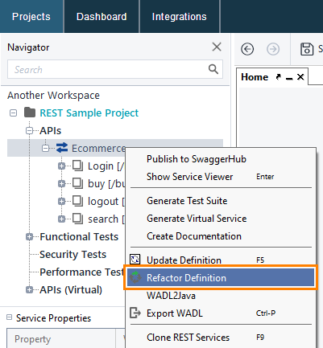
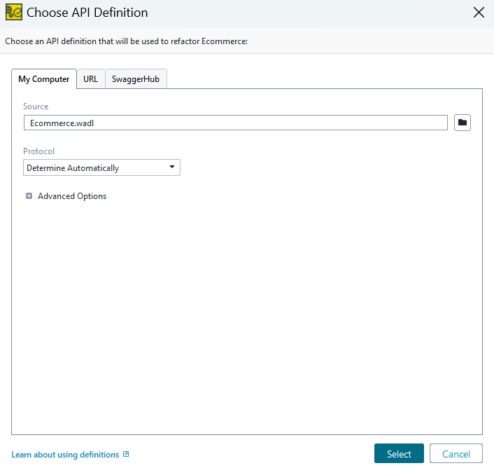
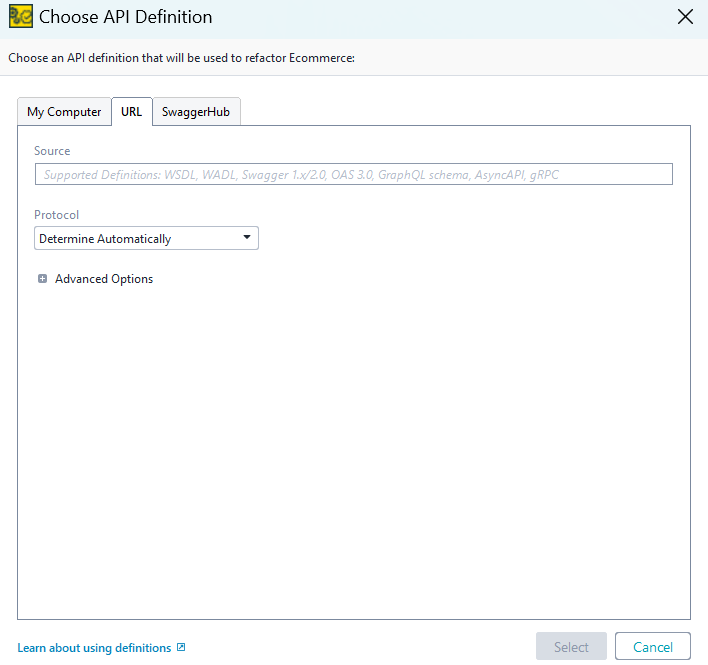
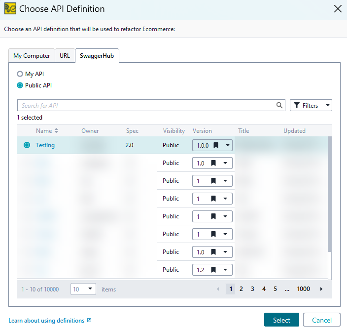
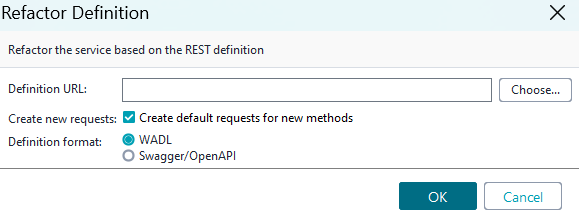
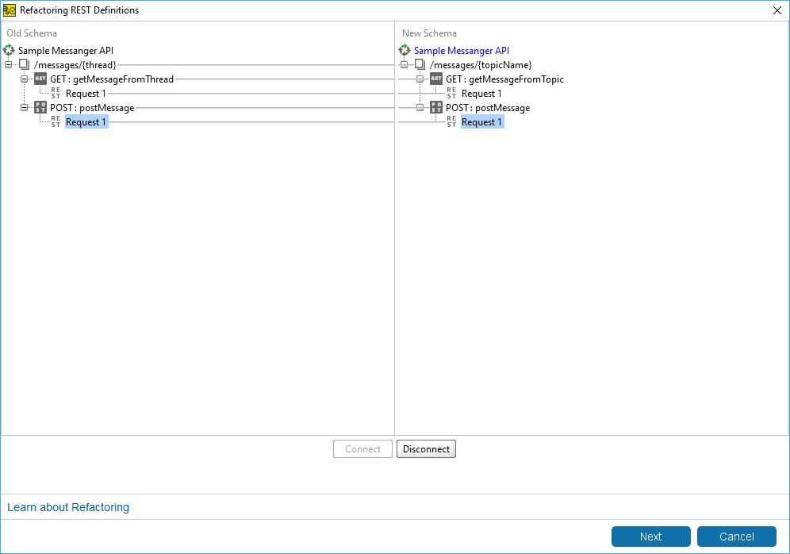
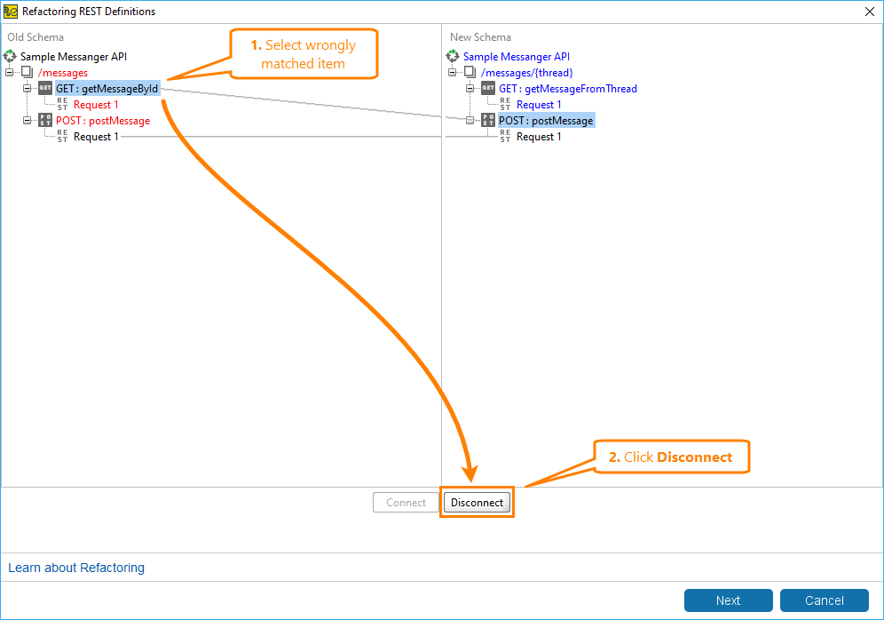
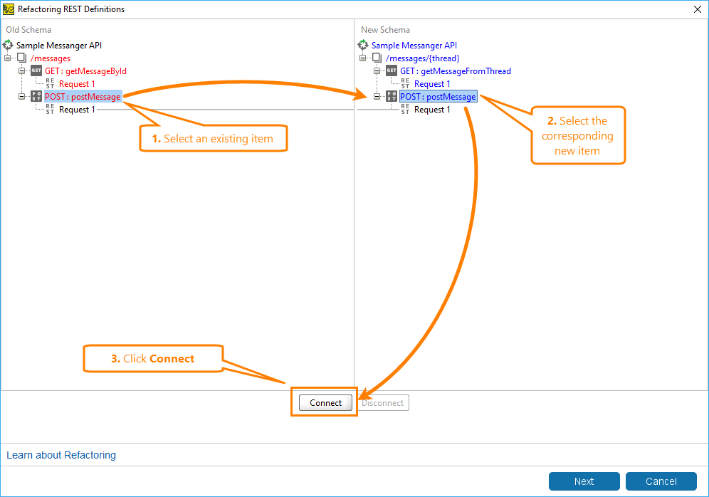
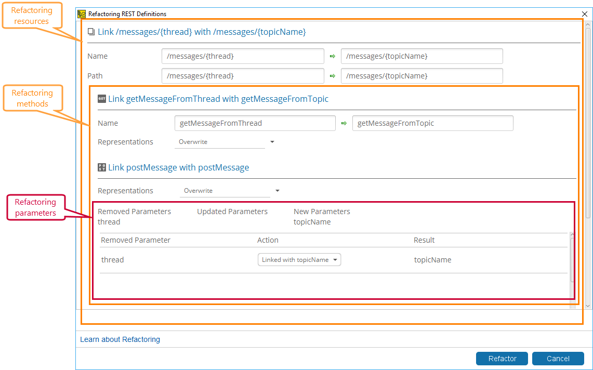

# Refactor REST APIs

Refactor your REST APIs to improve structure, readability, and maintainability.

---

## Before you begin

Make sure you:
- Open your project in ReadyAPI  
- Locate the REST service you want to refactor  

---

## Start refactoring

1. In the **Navigator**, right-click your REST service.
2. Select **Refactor Definition**.



---

## Select an API definition

Choose the API definition you want to use for refactoring.

### Option 1: Load from local file

Use this option when you have a local API definition file.

1. Select the **My Computer** tab.
2. Choose your API definition file (for example, `.wadl`).



---

### Option 2: Load from URL

Use this option when your API definition is hosted remotely.

1. Select the **URL** tab.
2. Enter the API definition URL.



---

### Option 3: Load from SwaggerHub

Use this option to browse and select APIs from SwaggerHub.

1. Select the **SwaggerHub** tab.
2. Choose a public or private API definition.
3. Select the version you want to use.



---

### Handle multiple services (WADL only)

If the definition contains multiple services:

1. Select the service you want to use  
   **or**  
2. Select **Use all WADL services**

> **Note:** Selecting all services increases the scope of refactoring and may affect multiple endpoints.

---

## Configure refactoring

Set how ReadyAPI applies the new API definition.

1. In the **Refactor Definition** dialog:
   - Provide the definition URL or file  
   - Choose the definition format (WADL or Swagger/OpenAPI)  
   - (Optional) Enable request generation  



> **Tip:** Enable request generation to automatically create requests for newly added methods.

---

## Map resources and methods

ReadyAPI attempts to match existing resources with the new definition.

### Review schema mapping

Review how ReadyAPI aligns your current API structure with the new definition before making changes.



> **Tip:** Focus on differences in resource paths and method names to identify mismatches early.

---

### Fix incorrect matches

If ReadyAPI matches resources incorrectly, disconnect them before remapping.

1. Select a mismatched item  
2. Click **Disconnect**



> **Tip:** Disconnect incorrect mappings before creating new ones to avoid conflicts.

---

### Create correct mappings

After cleaning up incorrect matches, create correct mappings.

1. Select an existing item  
2. Select the corresponding new item  
3. Click **Connect**



> **Tip:** Match endpoints based on functionality, not just naming, to ensure accurate mapping.

---

## Review parameter changes

Review how ReadyAPI updates parameters during refactoring:

- Removed parameters  
- Updated parameters  
- New parameters  

This step ensures that request inputs remain valid after changes.



> **Note:** Parameter changes can affect request behavior. Verify mappings carefully before proceeding.

---

## Apply refactoring

Apply the changes to update your API structure.

1. Click **Next**  
2. Review the summary  
3. Click **Refactor**

> **Warning:** Refactoring updates existing mappings and may overwrite current definitions.

---

## Result

After refactoring, ReadyAPI updates your API structure based on the new definition.

---

## Validate your changes

Verify that your updated API behaves as expected.

- Run your requests  
- Check responses  
- Fix any issues  

> **Tip:** Test critical endpoints first to quickly detect breaking changes.

---

## Example: Refactoring a resource

**Before**

```http
GET /api/v1/user
```

**After**
```
http
GET /api/v2/users
```

This change:
- standardizes naming (`user` → `users`)
- reflects versioning (`v1` → `v2`)

## Tips

- Refactor incrementally to avoid breaking changes  
- Validate after each change  
- Use consistent naming conventions  
- Keep your API structure intuitive